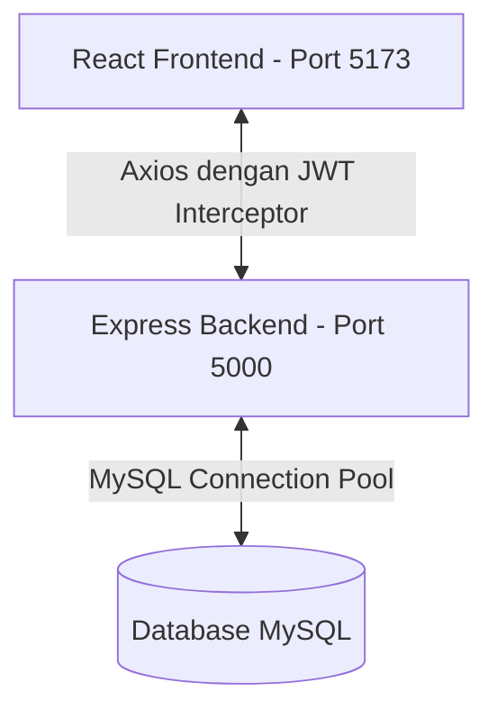
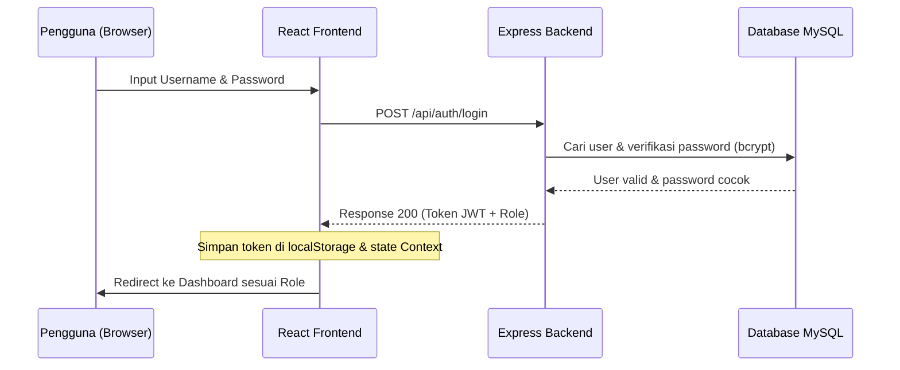

# 📌 Alur Kerja & Arsitektur Aplikasi KONI (Koni-App-Vite)

Dokumen ini menjelaskan alur kerja, arsitektur sistem, dan pembagian peran (*roles*) dalam aplikasi monitoring atlet KONI berbasis web.

---

## 🏗️ Arsitektur Sistem

Aplikasi ini menggunakan arsitektur **Client-Server** yang memisahkan frontend (React + Vite) dan backend (Node.js + Express) secara terpisah.

### Stack Teknologi:
- **Frontend**: React.js, Vite, Tailwind CSS v4, Axios, Context API.
- **Backend**: Node.js, Express.js, JWT (JSON Web Tokens), Multer (Upload File), Bcrypt.
- **Database**: MySQL.

---

## 🔑 Alur Autentikasi (JWT Flow)

Sistem menggunakan token JWT untuk mengamankan komunikasi API dan membatasi akses berdasarkan peran pengguna.

---

## 👥 Hak Akses & Peran Pengguna (Roles)

Aplikasi memiliki 4 tingkatan akses dengan hak kerja masing-masing:

### 1. 👑 Admin (KONI & Cabor)
- Mengelola data master atlet, pelatih, dan wasit.
- Melakukan CRUD data cabor (Cabang Olahraga).
- Membuatkan akun login untuk pelatih/atlet/wasit baru.

### 2. 📋 Pelatih
- Menyusun program latihan bulanan/mingguan.
- Melakukan presensi latihan atlet secara real-time.
- Memantau perkembangan fisik dan performa atlet binaan.

### 3. 🏃‍♂️ Atlet
- Melihat jadwal dan program latihan dari pelatih.
- Mengunggah sertifikat prestasi, foto kegiatan, atau laporan kesehatan (menggunakan file upload).
- Melihat riwayat presensi latihan.

### 4. ⚖️ Wasit / Juri
- Menginput riwayat dan hasil pertandingan resmi/uji coba.
- Membantu memberikan penilaian atau sertifikasi performa cabor tertentu.

---

## 📁 Struktur Penting Folder Projek

Berikut adalah gambaran ringkas struktur file dan folder utama pada aplikasi ini:

*   **`src/`** (Frontend React)
    *   `api/` — Konfigurasi Axios dan API interceptors.
    *   `context/` — Context API untuk manajemen status login (`AuthContext.jsx`).
    *   `pages/` — Halaman aplikasi (LandingPage, LoginPage, Dashboard, dll).
    *   `components/` — Komponen reusable (contoh: `QuillEditor.jsx`).
*   **`koni-backend/`** (Backend Node.js)
    *   `config/` — Konfigurasi koneksi database MySQL (`db.js`).
    *   `middleware/` — Proteksi rute dengan JWT dan upload handler (`multer`).
    *   `routes/` — Router endpoint API yang dipisahkan secara modular per fitur/peran.
    *   `uploads/` — Penyimpanan statis untuk file/gambar yang diunggah pengguna.

---

*Dokumen ini dibuat secara otomatis untuk membantu dokumentasi alur kerja tim selama proses pengembangan dan presentasi projek.*
